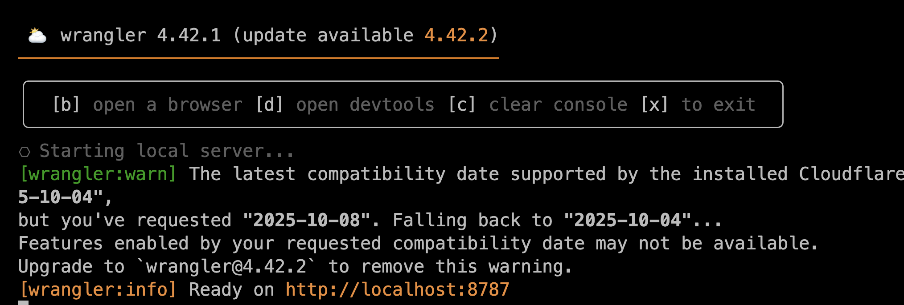
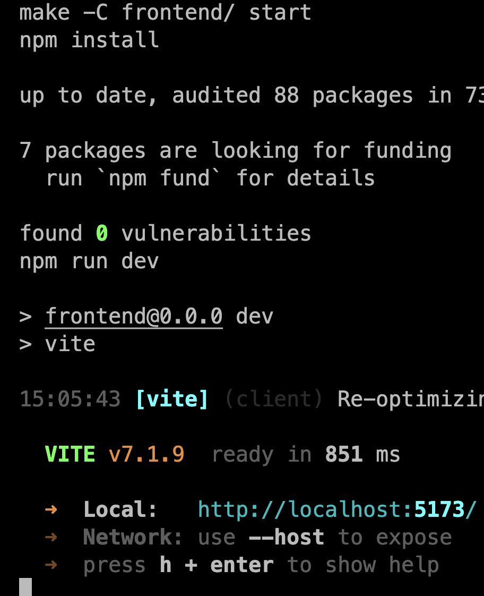

# 先進プロジェクト実験2 チーム2

## セットアップ方法


1. リポジトリをクローン
```bash
git clone https://github.com/kameiryohei/advanced-project-team2.git
```
2. VSCode Biome拡張機能インストール
https://marketplace.visualstudio.com/items?itemName=biomejs.biome

Makeコマンド使わない場合
1. backendディレクトリに移動し、依存関係をインストール
```bash
cd backend
npm install
```
2. frontendディレクトリに移動し、依存関係をインストール
```bash
cd ../frontend
npm install
```
3. ルートディレクトリに戻り、npmパッケージをインストール
```bash
cd ..
npm install
```     
4. backendを起動
```bash
cd backend && npm run dev
```


5. frontendを起動(別ターミナル起動で)
```bash
cd frontend && npm run dev
```

